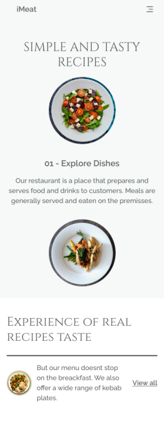
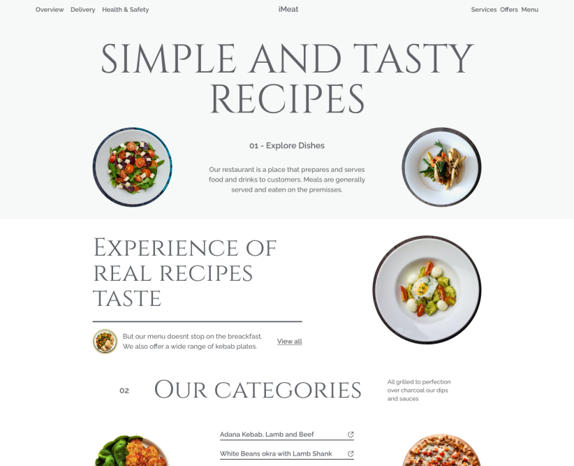

# 🍖 Restaurant Website (React.JS + Typescript + Tailwindcss)

Hi, welcome. This this my first project using tailwindcss. I wanted to pratice the _**new skill**_ by building this project. I still have to get used to it, but you wanna know what?! It was fun!!

> **Live preview: [https://imeat-restaurant-demo.vercel.app](https://imeat-restaurant-demo.vercel.app)**

**Preview screenshots:**

|            Mobile             |             Desktop             |
| :---------------------------: | :-----------------------------: |
|  |  |

## 🐾 Project Stack

- **Typescript** - a superset language of Javascript that provides typechecking.
- **Vite** - a next generation frontend tooling.
- **React.JS** - library used to build big, fast Web apps with JavaScript.
- **Styled Components** - library to write styles for components.
- **Tailwindcss** - a utility first styling library - fast, flexible, and reliable with zero-runtime.

## 🏗️ Testing and Local Setup

Make sure you have installed **Node.js (v18.17.0 or later recommended) which also comes with npm v9.6.7**.\
In the project directory, you can run in terminal:

```bash
npm install --save
npm run dev
```

Runs the app in the development mode and the server will reload when you make changes to the source code.

```bash
npm run build
```

Builds the app for production to the **dist folder**.

```bash
npm run start
```

Builds and starts the server in prodution.

## ☘️  Find me!

E-mail: [nhantumbok@gmail.com](nhantumbok@gmail.com 'Send an e-mail')\
Github: [https://github.com/KainNhantumbo](https://github.com/KainNhantumbo 'See my github profile')  
Portfolio: [https://codenut-dev.vercel.app](https://codenut-dev.vercel.app 'See my portfolio website')\
My Blog: [https://codenut-dev.vercel.app/blog](https://codenut-dev.vercel.app/blog 'Visit my blog site')

#### If you like this project, let me know by leaving a star on this repository so I can keep improving this app.😊😘

Best regards, Kain Nhantumbo.\
✌️🇲🇿 **Made with ❤ React + Vite and Typescript**

## 📜 License

Licensed under Apache License 2.0. All rights reserved.\
Copyright &copy; 2023 Kain Nhantumbo.

Licensed under the Apache License, Version 2.0 (the "License"); you may not use this file except in compliance with the License. You may obtain a copy of the License at http://www.apache.org/licenses/LICENSE-2.0

Unless required by applicable law or agreed to in writing, software distributed under the License is distributed on an "AS IS" BASIS, WITHOUT WARRANTIES OR CONDITIONS OF ANY KIND, either express or implied. See the License for the specific language governing permissions and limitations under the License.